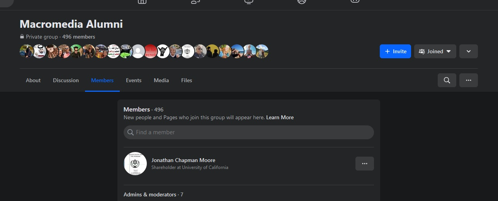

Macromedia Director Showcase

Active Desktop Templates only work in Windows 2000 to Windows XP SP1

To get the Active Desktop to Work use a Windows XP SP1 Installation in Virual Box and disconnet it from the network, with a file share.

<a href= "https://web.archive.org/web/20001002153818/http://www.macromedia.com/support/programs/usergroup.cgi?state=Virginia">Macromedia Alumni</a> 

<h2>Director 2004 MX</h2>
<a href= "https://archive.org/details/director_mx_2004">Macromedia Director 2004 MX</a>

<h2>Facebook</h2>

